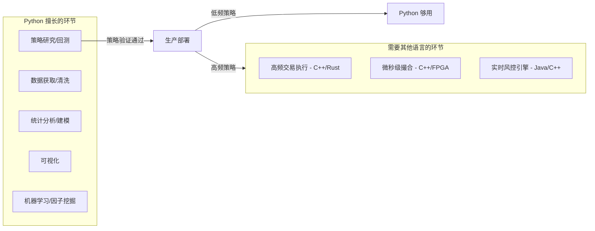

## Python 做量化，合不合适？

**短回答：Python 是量化领域使用最广泛的语言，没有之一。** 但它有明确的适用边界。

---

## Python 在量化中的定位



---

## 为什么量化圈几乎都用 Python

| 优势 | 说明 |
|------|------|
| **生态最强** | pandas、numpy、scipy、scikit-learn、pytorch、backtrader、zipline… 其他语言没有这么完整的量化工具链 |
| **数据源全部支持** | Tushare、Wind、同花顺、Bloomberg、Yahoo Finance 都有 Python SDK |
| **开发效率高** | 一个策略想法从构思到回测验证可能只需要几小时 |
| **社区最大** | QuantConnect、聚宽、米筐、优矿等量化平台全是 Python |
| **机器学习原生** | 如果你要做因子挖掘、深度学习选股，Python 是唯一现实选择 |

---

## Python 的真实瓶颈

| 场景 | 问题 | 解决方式 |
|------|------|----------|
| **回测大量数据慢** | 10年分钟线回测可能要跑几分钟 | 用 numpy 向量化，或 numba/cython 加速 |
| **实盘下单延迟** | Python 下单延迟约 1-10 毫秒 | 低频策略（持仓几天/几周）完全无所谓 |
| **高频交易** | 微秒级响应 Python 做不到 | 这个用 C++/Rust，但你作为个人投资者不需要 |
| **GIL 并发限制** | 多线程不能真正并行计算 | 用多进程，或 asyncio 处理 IO |

---

## 关键判断：你做什么频率的策略？

| 策略频率 | Python 够不够 | 典型例子 |
|----------|--------------|----------|
| **日线级别（持仓天~周）** | 完全够用 | 趋势跟踪、价值投资、止盈策略 |
| **小时/分钟级别** | 够用 | 日内动量、均线突破 |
| **秒级（中频）** | 勉强，需要优化 | 期权做市、统计套利 |
| **毫秒/微秒（高频）** | 不行 | 做市商、闪电套利 |

---

## 现实中谁在用 Python 做量化

- **国内私募基金**：幻方、九坤、明汯的研究端全用 Python（执行端用 C++）
- **个人量化**：聚宽、米筐、优矿等国内量化平台 100% Python
- **华尔街**：Two Sigma、Citadel、DE Shaw 的 quant researchers 主力工具是 Python
- **对冲基金通用模式**：Python 做研究 → 验证有效 → C++ 重写执行端（仅高频需要）

---

## 对你来说

根据你之前说的（接入同花顺/Tushare，验证 AlphaGBM 的方法论，分析 A 股/期权）：

**Python 是最佳选择，没有第二个。** 原因：

1. 你做的是**日线级别的分析和回测**，不是高频
2. Tushare/同花顺数据接口都是 Python 的
3. 你的技术栈已经是 Python（FastAPI）
4. 回测框架 backtrader / vnpy / qlib 都是 Python
5. 就算未来做期权定价（Black-Scholes），scipy 一行代码搞定

**不需要纠结语言选择，Python 就是量化散户和研究员的标准答案。** 只有当你哪天管了几十亿资金、需要毫秒级下单时，才需要考虑 C++。


## 一、哪些 Skills 适合中国市场

### 直接可用（A股/港股都有对应品种）

| Skill | 适用原因 |
|-------|----------|
| **alphagbm-stock-analysis** | A股/港股都能做基本面+技术面分析 |
| **alphagbm-compare** | 多股横向对比，任何市场都适用 |
| **alphagbm-take-profit** | 过山车率是纯价格计算，跟市场无关 |
| **alphagbm-watchlist** | 自选股管理，通用功能 |
| **alphagbm-alert** | 价格/技术指标提醒，通用 |
| **alphagbm-company-profile** | PE/PB 历史区间分析，A股/港股都适用 |
| **alphagbm-investment-thesis** | 记录买入逻辑/退出条件，纯管理功能 |
| **alphagbm-theme-research** | 主题投资，中国很流行（AI概念、新能源、白酒…）|
| **alphagbm-health-check** | 知识库管理，通用 |
| **alphagbm-market-sentiment** | 市场情绪分析，需要替换指标来源 |
| **alphagbm-macro-view** | 宏观追踪，中国投资者也关注美债/美元/黄金 |

### 部分适用（有期权的品种才行）

| Skill | 中国现状 |
|-------|----------|
| **alphagbm-iv-rank** | ✅ 50ETF期权/300ETF期权/个股期权（少数）可用 |
| **alphagbm-greeks** | ✅ 同上，有期权就能算 |
| **alphagbm-options-score** | ✅ 但中国期权品种少，链不像美股那么丰富 |
| **alphagbm-vol-smile** | ✅ 50ETF期权有明显的微笑/偏斜 |
| **alphagbm-vol-surface** | ⚠️ 中国期权到期日少（通常只有4个），曲面比较稀疏 |
| **alphagbm-pnl-simulator** | ✅ 数学计算，跟市场无关 |
| **alphagbm-options-strategy** | ⚠️ 中国期权策略受限（不能裸卖Call、T+0限制等） |
| **alphagbm-earnings-crush** | ⚠️ A股没有"IV Crush"文化，期权品种太少 |

### 基本不适用中国

| Skill | 原因 |
|-------|------|
| **alphagbm-vix-status** | A股没有官方VIX，需自己算替代指标 |
| **alphagbm-fear-score** | 6个因子中多个依赖美股期权数据（IV Rank、PCR） |
| **alphagbm-bps-backtest** | Bull Put Spread 在中国期权市场流动性不足 |
| **alphagbm-duan-analysis** | 段永平买的是美股期权，A股期权做不了这套 |
| **alphagbm-hedge-advisor** | Collar/Long Put 需要个股期权，A股极少有 |
| **alphagbm-unusual-activity** | A股期权成交量小，异常活动检测意义不大 |
| **alphagbm-polymarket** | Polymarket 中国无法使用 |

---

## 二、数据源对比

| | **Tushare** | **同花顺 iFinD** | **Wind** |
|---|---|---|---|
| **价格** | 免费（基础）/ 200元/年（Pro） | 机构版几万/年；个人版无 | 2-5万/年起 |
| **免费额度** | ✅ 有，注册就有积分换额度 | ❌ 个人基本没有免费 | ❌ 无免费 |
| **A股日线** | ✅ 免费 | ✅ 付费 | ✅ 付费 |
| **期权数据** | ✅ Pro 有（50ETF/300ETF期权） | ✅ 有，更全 | ✅ 最全 |
| **实时行情** | ⚠️ 有延迟（15-30分钟） | ✅ 实时 | ✅ 实时 |
| **速度** | 中等（HTTP API） | 快（本地客户端） | 快（本地客户端） |
| **Python 接口** | ✅ `tushare` 包 | ⚠️ 需自己封装 | ✅ `WindPy` |
| **适合谁** | 个人/学生/小团队 | 券商/机构 | 基金/券商 |
| **上手难度** | 低 | 高 | 中 |

---

## 三、我的建议

**如果你是个人开发者学习验证，用 Tushare Pro：**

```python
# 安装
pip install tushare

# 使用示例
import tushare as ts
ts.set_token('你的token')  # 注册 tushare.pro 获取
pro = ts.pro_api()

# 获取日线数据
df = pro.daily(ts_code='000001.SZ', start_date='20200101')

# 获取期权日线（需要积分够）
df = pro.opt_daily(exchange='SSE', trade_date='20260507')
```

**免费额度情况（Tushare Pro）：**
- 注册送积分，基础 A 股日线/财务数据免费
- 期权数据需要 2000+ 积分（通过完善资料、邀请好友攒，或直接买 200 元/年）
- 每分钟调用次数有限制（免费约 200次/分钟）

**如果后面要做实时交易系统，再考虑升级到同花顺/Wind。**

---

## 四、务实路径

```
第一步：Tushare Pro 免费注册，拿 A 股日线 + 50ETF 期权数据
第二步：实现 alphagbm-take-profit（过山车率），纯价格计算最简单
第三步：实现 alphagbm-stock-analysis 的简化版（PE/PEG/RSI）
第四步：如果你玩期权，再做 alphagbm-iv-rank（50ETF 期权 IV 计算）
```

先跑通一个再扩展，别贪多。